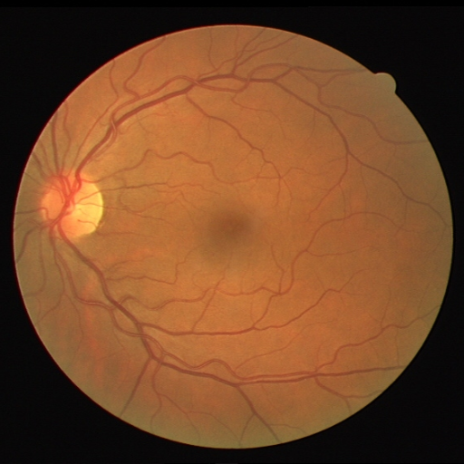
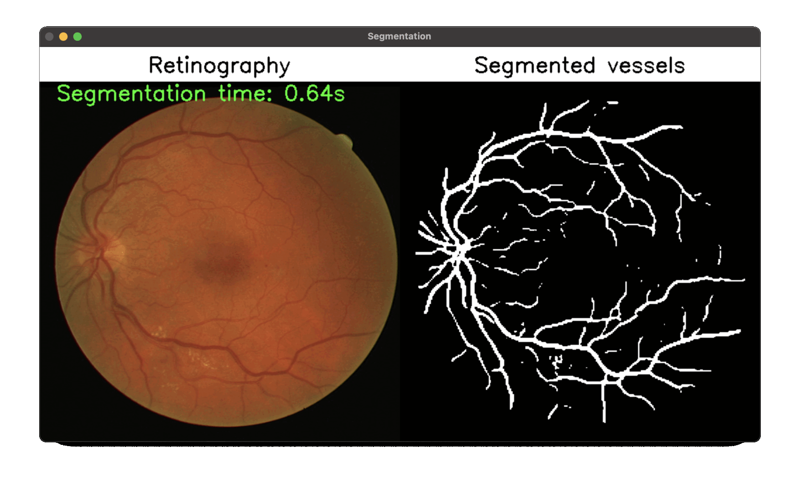

# Blood Vessel Segmentation
This is a computer vision project focused on blood vessel segmentation in medical images using a U-Net architecture trained with TensorFlow/Keras in Python, and later converted to TensorFlow Lite for efficient inference in a C++ application.

The goal is to build a complete and optimized pipeline, from data preprocessing to embedded inference using TFLite.

📌 Objectives
- Train a U-Net neural network for blood vessel segmentation
- Export the trained model to .tflite format
- Integrate and run inference with TensorFlow Lite in C++
- Ensure performance and portability for embedded systems

⚙️ Technologies Used
- Python 
- TensorFlow / Keras
- U-Net (segmentation architecture)
-  TensorFlow Lite
- C++ (with CMake)
- OpenCV (for image handling in C++)

# Dataset
The dataset used in this project was the retinal blood vessel segmentation dataset available on [kaggle](https://www.kaggle.com/datasets/abdallahwagih/retina-blood-vessel). This set contains images of the fundus of the eye and their respective annotations, thus having 50 images in total.
<p align="center">
  
  
</p>

# Trained models
- Create a folder called models in the project root

- Then, in this [link](https://drive.google.com/drive/folders/1BSzh13n7pr8KNmN5PiCP62dL1WPq20_L?usp=sharing), you can download the original ``.keras`` model and the ``.tflite`` model (we will use this one to perform the inference)

# TensorFlow Lite
TensorFlow Lite is a lightweight version of TensorFlow designed to run machine learning models on devices with limited resources, such as smartphones, microcontrollers, and embedded systems. It enables on-device inference, which improves speed, ensures data privacy, reduces internet usage, and allows offline operation.

Models are first trained in standard TensorFlow and then converted to the .tflite format. TFLite supports optimizations like quantization to reduce model size and improve performance. It also offers hardware acceleration through GPU, NNAPI, and Edge TPU, and supports programming in Python, Java, C++, and Swift.

Common applications include image classification, object detection, speech recognition, and offline translation. TFLite is ideal for deploying efficient and fast machine learning solutions directly on edge devices.

# Model conversion to TFLite
- This step is not mandatory unless you train the model again or want to use this function in isolation, feel free.

- To convert the model trained by tensorflow into a .tflite model, simply run the ``create_tf_lite_model.py`` file with the following command:
```
python create_tf_lite_mode.py
```
- The ``.tflite`` file will be saved in the models folder with the name ``segment_model.tflite``.

#  🚀 Get started
- Clone the repository:
```
git clone https://github.com/colaresm/blood-vessel-segmentation.git
cd blood-vessel-segmentation
```

- This repository already contains the model already trained and ready to perform inference. If you want to change any parameter (see the ``train.py`` file) and perform the training again, follow the instructions below. Otherwise, skip to the next step.
- If you want to perform a new training, make sure to download the dataset and place it inside a folder called ``data``

## Training  
- To run the training, simply use the following command:
```
python train.py
```

# Inference
- The file responsible for reading the .tflite model and executing the entire inference process is located in ``inference/main.cpp``.

- If you are using Windows:
```
cd inference
mkdir build && cd build
cmake ..
#open TFLiteCheck.sln in Visual Studio.
#Build Release x64
cd Release
.\SegmentBloodVessels path_of_image
```
- If you are using MacOs:
```
cd inference
mkdir build && cd build
cmake ..
make
.\SegmentBloodVessels path_of_image
```


- The following result will be displayed:

<p align="center">
  
</p>

* The ``images`` folder has some examples that you can use for testing.

# Contributing

1. Fork the repository.
2. Create a branch for your changes (`git checkout -b feature/new-feature`).
3. Commit your changes (`git commit -am 'Add new feature'`).
4. Push to the branch (`git push origin feature/new-feature`).
5. Open a pull request.

# Contact

- **Email**: colaresmarcelo2022@gmail.com
- **LinkedIn**: [engmarcelocolares](https://www.linkedin.com/in/engmarcelocolares/)

# Reference

[TensorFlow Lite](https://www.tensorflow.org/lite/guide?hl=pt-br)

[Flatbuffers](https://flatbuffers.dev)